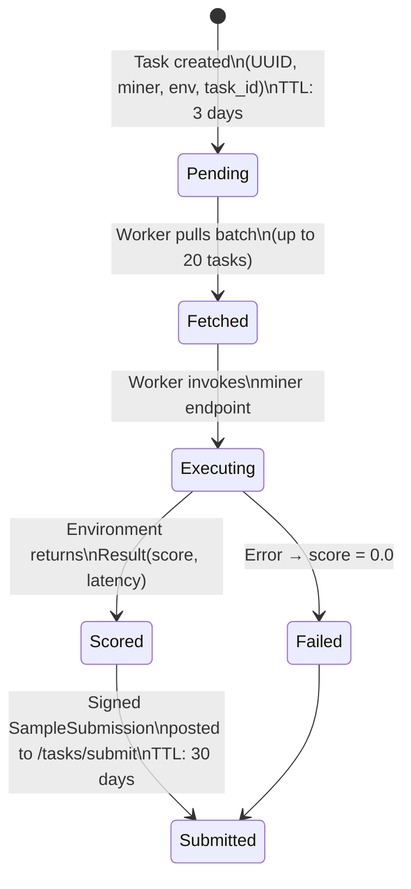
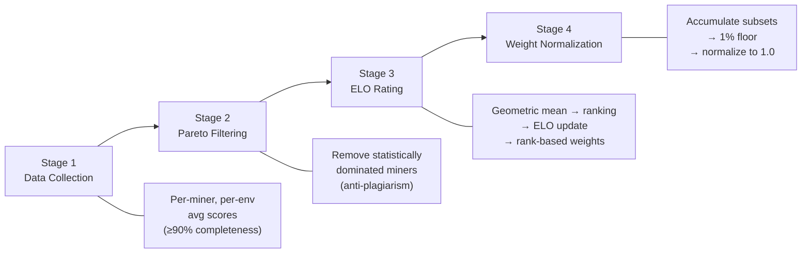
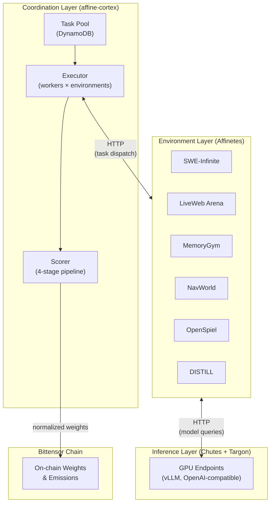
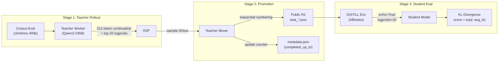

# Affine: An Incentivized Reinforcement Learning Environment for Open Reasoning

---

## 1. Abstract

Affine is a decentralized evaluation and training system built on Bittensor whose central thesis is that the next leap in agentic capability comes not from scaling pretraining alone, but from **reinforcement-learning post-training inside Affine's own purpose-built environments**. Static benchmarks are structurally inadequate for this goal: fixed task sets saturate through contamination, single-turn formats miss interactive capabilities, and one-off scripts do not scale to training loops. Affine inverts this paradigm — the same renewable environment suite that scores miners also serves as the RL training substrate that produces them, and the on-chain incentive structure relentlessly drives every miner to post-train on these environments until its model surpasses the base Qwen3-32B on every capability axis. The system is composed of four contributions. First, a **scoring mechanism** built on Pareto dominance filtering, ELO-based temporal ratings, and a dual-signal anti-copy detector that incentivizes genuine model improvement on the Bittensor network. Second, a **container-orchestration infrastructure** (Affinetes) that packages environments as reproducible Docker services with SSH-tunneled communication and multi-instance load balancing — separating environment execution from GPU inference. Third, a **family of six evaluation environments**: software engineering (SWE-Infinite: continuously generated multi-language tasks from GitHub repositories), browser-grounded web interaction (LiveWeb Arena: 197 million configurations with real-time ground truth), memory management (MemoryGym: selective storage under write-budget constraints), tool-mediated planning (NavWorld: six MCP tools over 10,000+ renewable tasks), strategic game-playing (OpenSpiel: 22 games with trajectory diversity exceeding 10^60), and distributional alignment (DISTILL: per-token KL-divergence training signals from teacher rollouts). Fourth, **empirical evidence that the post-training loop works**: Affine-trained miner models outperform the base Qwen3-32B on external benchmarks not used in training — including +14% on MCP-Bench task completion, +51% on MemoryAgentBench F1, and non-trivial SWE-rebench scores (12.28) where the base model achieves zero. All environments provide deterministic seeding, structured reward signals (ranging from dense per-step shaping to per-task binary outcomes), and renewable task generation — serving simultaneously as evaluation benchmarks and as reinforcement-learning training substrates that have already pushed miner models past the base model.

---

## 2. Introduction

The dominant paradigm for evaluating large language models relies on static benchmark suites: fixed collections of question-answer pairs scored by exact match, multiple choice accuracy, or automated code execution. Benchmarks such as MMLU, HumanEval, and GSM8K have driven rapid progress in model development, but they share structural limitations that become acute as the field moves toward agentic systems — models that must act, plan, use tools, and interact with dynamic environments over extended horizons.

**Static benchmarks saturate.** A fixed test set is vulnerable to contamination through training data overlap, deliberate or accidental memorization, and benchmark-specific optimization. SWE-bench Pro, one of the most rigorous software engineering benchmarks, contains approximately 2,300 instances. Once a model has been trained on or tuned against a dataset of this scale, marginal score improvements may reflect overfitting rather than genuine capability gains. The problem compounds in open networks where model weights are public: any participant can download a leading model, make superficial modifications, and claim credit for equivalent performance.

**Static benchmarks miss agentic capability.** Recent interactive benchmarks — WebArena for browser navigation, AgentBench for multi-domain tool use, Mind2Web for web interaction trajectories, ToolBench for API orchestration — have begun to address this gap. However, most rely on fixed website snapshots, human-authored trajectories, or small task pools that are themselves subject to saturation. A model that scores well on closed-form reasoning may fail at multi-step tool orchestration, real-time web navigation, or long-horizon memory management under budget pressure. What is needed is not merely interactive evaluation, but interactive evaluation with a *renewable* task supply.

**Fixed task sets cannot serve as training substrates.** For reinforcement learning to work, the training environment must supply a continuous stream of diverse tasks. Even SWE-bench Pro's 2,300 instances are exhausted within a handful of training epochs. What is needed is not a larger static dataset but a generative process that produces fresh, validated tasks continuously — tasks diverse enough to prevent overfitting and structured enough to provide meaningful reward signals.

**Infrastructure is an underappreciated bottleneck.** Even when interactive environments exist, deploying them at scale introduces engineering challenges that benchmark papers rarely address: containerization, reproducibility across machines, concurrent evaluation of multiple models, secure communication, and efficient resource management. Without a robust infrastructure layer, interactive environments remain research prototypes rather than operational systems.

Affine addresses these limitations through a system-level approach built on **Bittensor**, a decentralized network in which independent participants (miners) compete to provide useful computational work and are rewarded with token emissions proportional to their demonstrated quality. Bittensor organizes work into subnets, each governed by validators who score miner contributions and set on-chain weights. Affine operates as Subnet 120, directing this incentive structure toward a single concrete objective: **driving miners to perform reinforcement-learning post-training inside Affine's own environments until their models surpass the base Qwen3-32B**. The system does not prescribe an RL recipe, dataset, or training pipeline; instead, it exposes a renewable, training-friendly environment suite with structured reward signals, then lets the on-chain incentive — emissions allocated proportionally to demonstrated cross-environment capability — pull miners toward continuous post-training. The result is a closed loop in which the same environments that score a model are the ones miners optimize against to build the next, stronger model.

The system combines five contributions:

1. **A decentralized evaluation and scoring mechanism** that incentivizes genuine model improvement while resisting plagiarism, overfitting, and gaming. The mechanism uses Pareto dominance filtering with statistical significance thresholds, ELO-based temporal ratings, and a two-signal anti-copy detector that analyzes model internals. Miners submit models that are evaluated across the full environment suite, with emissions allocated proportionally to demonstrated capability.

2. **A container-orchestration infrastructure layer** (Affinetes) that packages evaluation environments as reproducible, isolated Docker services with automatic lifecycle management, secure SSH-tunneled communication, and multi-instance load balancing. Environment developers write only business logic; the framework handles deployment, scaling, and inter-process communication. This separation allows environments to be developed independently and deployed across distributed clusters.

3. **A family of interactive evaluation environments** targeting capabilities that static benchmarks miss:

   - **SWE-Infinite**: a continuously expanding software engineering environment that auto-discovers repositories, generates validated task instances across multiple programming languages, and applies multi-layer quality filtering — producing a renewable task supply that resists saturation.
   - **LiveWeb Arena**: a real-time web interaction environment where agents navigate live websites (financial data, weather services, cryptocurrency exchanges, blockchain explorers), with a combinatorial task space exceeding 197 million unique task identifiers and dynamic ground truth that changes with real-world data.
   - **MemoryGym**: a memory management benchmark that tests selective storage, incremental updates, and reasoning under write-budget constraints, using correction events that dynamically alter world state — defeating shortcut strategies through nine verified simulation protocols.
   - **NavWorld**: a tool-mediated travel planning environment requiring multi-step tool orchestration (POI search, navigation, weather, flight and train queries), with 10,000+ renewable tasks generated from city-type-difficulty combinations and weekly salt rotation.
   - **GAME (OpenSpiel)**: a strategic reasoning environment built on DeepMind's OpenSpiel framework, spanning 22 games organized into seven quality tiers and selected for trajectory diversity (minimum 100 distinct trajectories per configuration), from imperfect-information card games to deterministic board games with effectively infinite game trees.

4. **Training-friendly design choices** throughout the system: deterministic seeding for reproducibility, structured reward signals for policy learning (from dense per-step shaping in LiveWeb and NavWorld to per-task outcomes in SWE-Infinite and per-position distributional signals in DISTILL), geometric mean scoring that forces broad-spectrum competence, and task rotation mechanisms that prevent environmental overfitting.

5. **Preliminary empirical evidence** that Affine-trained models outperform the base Qwen3-32B on external benchmarks not used in training, including improvements on browsing comprehension, tool-use execution, memory retrieval, and software engineering tasks — with SWE-rebench scores rising from zero (base) to 12.28 (best miner).

The remainder of this paper is organized as follows. Section 3 describes the Affine mechanism — the evaluation pipeline, scoring logic, and anti-plagiarism defenses that govern the incentive network. Section 4 presents the system architecture, focusing on how Affinetes and Chutes separate environment execution from model inference. Section 5 details each evaluation environment, including a distributional alignment environment (DISTILL) that provides per-token training signals via KL divergence. Section 6 presents external benchmark results demonstrating that Affine-trained models outperform the base model. Section 7 outlines the future roadmap, and Section 8 concludes with limitations.

---

## 3. The Affine Mechanism

### 3.1 System Participants and Roles

Affine operates as a decentralized evaluation network built on Bittensor (Subnet 120). The system comprises three principal roles (summarized in Table 1):

**Miners** are independent participants who train, host, and submit machine learning models. A miner's workflow proceeds through four steps: (1) obtain a base model from the network via `af pull`, (2) improve the model through reinforcement learning or other training methods, (3) deploy the model as a serverless inference endpoint on Chutes, and (4) commit the deployment metadata — including the Hugging Face repository, revision hash, and Chute identifier — to the Bittensor blockchain. Each hotkey may hold exactly one active commitment at any time. To ensure fair comparison, all submitted models must conform to the Qwen3-32B architecture (hidden_size=5120, num_hidden_layers=64), and quantized models are rejected.

**Validators** are blockchain-registered nodes responsible for setting on-chain weights. Validators fetch pre-computed normalized weights and submit them to the Bittensor chain, preserving the decentralized weight-setting protocol.

**Environments** are the evaluation substrates — containerized services deployed via Affinetes that present tasks to models and return scores. Affine defines a library of canonical environments (currently eighteen, including deduction, abduction, code generation, code editing, logic puzzles, game-theoretic problems, browser-based web interaction, navigation, memory, and knowledge evaluation), of which a dynamically configured subset is enabled for scoring at any given time. Each environment exposes a standard interface: either a single-turn evaluate call or a multi-turn OpenEnv protocol (reset → step → stop). The active environment set is retrieved dynamically at scoring time, allowing the suite to expand without changes to the scoring pipeline.

**Table 1. System Participants and Responsibilities**

| Role | Primary Function | Trust Model | Key Constraint |
|---|---|---|---|
| **Miner** | Train and deploy models; compete for emissions | Untrusted — incentive-aligned via scoring | Must conform to Qwen3-32B architecture; one active commitment per hotkey |
| **Validator** | Set on-chain weights on Bittensor chain | Blockchain-registered; fetches pre-computed weights | Does not perform scoring directly |
| **Environment** | Present tasks to models and return scores | Containerized via Affinetes; standardized interface | Exposes single-turn `evaluate` or multi-turn OpenEnv protocol |

### 3.2 Task Lifecycle

The evaluation pipeline is driven by a pull-based task pool architecture backed by DynamoDB. Figure 1 illustrates the full task lifecycle.

**Figure 1. Task Lifecycle**



**Task creation.** The system generates evaluation tasks for each active miner across all environments. Each task is identified by a unique UUID and keyed by miner hotkey, model revision, environment, and task ID. Tasks are created with `pending` status and a three-day time-to-live.

**Task fetch.** Each worker subprocess runs a continuous fetch loop, pulling batches of up to 20 pending tasks from the task pool. Fetching is demand-driven: the worker only requests new tasks when its internal queue falls below the concurrency limit.

**Task execution.** Workers pull tasks from an internal asyncio queue and invoke the target miner's inference endpoint through the environment SDK. The environment returns a `Result` object containing the score (which may be negative for some environments), latency, success status, and optional metadata. Failed executions are recorded with a score of 0.0 and an error description.

**Result submission.** Each result is packaged into a cryptographically signed `SampleSubmission` (task UUID, score, latency, metadata) and persisted with a 30-day TTL. Worker liveness is monitored and dead subprocesses are automatically restarted.

### 3.3 Evaluation Loop and Sampling Strategy

Affine's evaluation loop is designed to resist two failure modes common in static benchmarks: task saturation (where models memorize fixed test sets) and sampling bias (where some miners receive systematically easier or harder tasks).

**Sampling rotation.** The system maintains a sampling list per environment that rotates tasks over time. New tasks are added at the end of the list while consumed tasks are removed from the front, preserving discovery order. A safety check prevents any sampling window from consuming more than 80% of the available dataset, ensuring that tasks remain renewable and that no miner can overfit to a narrow task distribution.

**Completeness validation.** Before a miner's scores enter the scoring pipeline, the system verifies that the miner has completed at least 90% of assigned tasks in each environment. Miners below this threshold are excluded from the current scoring round, preventing partial evaluation from distorting rankings.

**Common-task alignment.** When comparing two miners, the scoring pipeline restricts comparison to the intersection of tasks that both miners have completed — ensuring that score differences reflect capability differences, not task-assignment differences.

### 3.4 The Scoring Pipeline

Affine computes miner weights through a four-stage pipeline that transforms raw per-task scores into normalized blockchain weights (Figure 2).

**Figure 2. Four-Stage Scoring Pipeline**



#### Stage 1: Data Collection

The collector parses raw evaluation data, computing per-miner, per-environment average scores. Environment-specific score ranges are normalized to [0, 1]. Only miners meeting the 90% completeness threshold proceed to subsequent stages. The output is a set of `MinerData` objects, each containing a map of environment scores with averages, sample counts, and per-task score vectors.

#### Stage 2: Pareto Frontier Filtering

This stage identifies and removes miners whose performance is statistically dominated by an earlier submission — the primary defense against model plagiarism at the scoring level.

For each pair of miners (A, B) where A committed to the blockchain first, the system tests whether A dominates B across all environments. Dominance is determined by a statistical threshold derived from a binomial confidence interval:

> SE = sqrt(p * (1 - p) / n)
> gap = z * SE
> gap = clamp(gap, MIN_IMPROVEMENT, MAX_IMPROVEMENT)
> threshold = min(prior_score + gap, 1.0)

where `p` is miner A's score, `n` is the number of common tasks, and `z` is the z-score (default 2.0, corresponding to approximately 95.4% confidence). The gap is bounded between a 2% floor and a 10% ceiling. Miner A dominates B only if B fails to exceed A's threshold in *every* environment in the evaluated subset. This ensures that a copy — which will perform nearly identically to the original — is filtered out, while a genuinely improved model that exceeds the statistical threshold survives.

The first-commit advantage is enforced by sorting miners by `first_block` before applying dominance tests. An earlier submission can only be dominated by a later one that demonstrates statistically significant improvement, not by random variance.

#### Stage 3: ELO Rating and Weight Distribution

Surviving miners are ranked within each scoring round using a geometric mean of their environment scores:

> GM = ((v1 + ε) · (v2 + ε) · … · (vn + ε))^(1/n) − ε

where ε = 0.1 provides smoothing to prevent a single zero-score environment from collapsing the aggregate. This forces miners to maintain competence across *all* environments rather than specializing narrowly.

Rankings feed into an ELO rating system that tracks miner performance across scoring rounds, providing temporal smoothing that a single-round ranking cannot. Table 2 lists all key parameters.

- **Base rating**: 1200 — deliberately below average to prevent new-key spam from immediately competing for emissions.
- **K-factor**: 96 for provisional miners (first 48 rounds), decaying to 32 for established miners. At the default scoring interval, the provisional period spans approximately one to two days. The higher provisional K-factor allows genuinely strong new entrants to converge quickly while established miners are not dislodged by noise.

**Absence decay.** Miners that do not participate in a scoring round — due to incomplete sampling, Pareto filtering, or being offline — experience accelerating rating decay:

> rating = BASE + excess × 0.95^(rounds^1.4)

A two-round grace period (approximately one hour) prevents brief outages from triggering decay. The super-linear exponent (1.4) means that early missed rounds cost little, but sustained absence accelerates rapidly — stale ratings converge to the base within approximately 18 hours, preventing inactive miners from occupying weight slots indefinitely.

**Weight distribution** follows a rank-based decay model: the top-ranked miner receives a base weight, and each subsequent rank receives 50% of the previous rank's weight (`weight = 0.5^(rank − 1)`). All miners with at least one ELO round played receive weight, not only those participating in the current round.

**Table 2. ELO Rating and Weight Distribution Parameters**

| Parameter | Value | Rationale |
|---|---|---|
| Base rating | 1200 | Below average; prevents new-key spam from immediately competing |
| K-factor (provisional) | 96 | High responsiveness for first 48 rounds (~1–2 days) |
| K-factor (established) | 32 | Stability for long-running miners |
| Absence decay rate | 0.95^(rounds^1.4) | Super-linear: early misses cost little, sustained absence converges to base in ~18 hours |
| Grace period | 2 rounds (~1 hour) | Prevents brief outages from triggering decay |
| Weight decay per rank | 0.5^(rank − 1) | Top miner gets 1.0, rank 2 gets 0.5, rank 3 gets 0.25, etc. |
| Minimum weight threshold | 1% | Below-threshold weight redistributed to UID 0 |

#### Stage 4: Weight Normalization

The final stage accumulates subset weight contributions per miner, applies a 1% minimum weight threshold, and normalizes the remaining weights to sum to 1.0. Miners below the threshold have their weight redistributed to UID 0 — a mechanism the team also uses deliberately to burn emissions during periods of infrastructure instability, security incidents, or scoring corrections.

### 3.5 Anti-Plagiarism Mechanisms

Model copying is the central adversarial threat in decentralized training markets: a rational but unscrupulous participant can download a leading model, make trivial modifications, and redeploy it to capture emissions without contributing genuine improvement. Affine addresses this through three complementary mechanisms (Table 3).

**Pareto dominance filtering** (described in Section 3.4, Stage 2) operates at the scoring level. Because copies perform nearly identically to the original on common tasks, they cannot exceed the statistical improvement threshold and are filtered as dominated.

**The anti-copy detector** operates as an independent periodic background service (default: 24-hour cycle) that analyzes model internals rather than output scores alone. Unlike Pareto filtering, which runs inline during each scoring round, the anti-copy detector stores its results in a separate audit table for review and policy enforcement. It uses a two-signal voting system:

1. **Hidden-state signal**: For each shared task, the detector computes the cosine similarity of the models' internal hidden-state representations. If the median cosine similarity across all common tasks exceeds 0.99, the signal votes "copy." A norm-deviation gate then checks the per-task L2 norm ratios (‖h_A‖/‖h_B‖) across all shared tasks and computes the maximum of (a) the absolute deviation of the mean ratio from unity and (b) the cross-task standard deviation. If either exceeds 5%, the hidden-state vote is overridden to "not copy." This gate exploits an empirical observation: true copies maintain norm ratios that are both close to 1.0 and stable across tasks (standard deviation below 3%), while fine-tuned models exhibit significant norm drift (standard deviation above 10%) even when cosine similarity remains high.

2. **Logprob signal**: The detector compares the top-3 token log-probability distributions up to the point where the models' generated tokens diverge. If the median cosine similarity of these distributions exceeds 0.99, the signal votes "copy."

A miner is flagged as a copy only if *both* signals vote "copy" and at least 30 shared tasks are available for comparison. This dual-signal requirement sharply reduces false positives: fine-tunes are caught by the norm gate, and models with similar outputs but different internals are caught by the hidden-state signal. Detection results are persisted to the `anti_copy_results` table (with 30-day TTL) but do not automatically feed into the scoring pipeline; the Pareto filter in Stage 2 remains the sole automatic anti-plagiarism mechanism during scoring. The anti-copy detector serves as a deeper forensic layer whose findings can inform manual review or future automated blacklisting.

**First-commit advantage** provides a temporal tiebreaker. When two models produce statistically indistinguishable scores, the model committed to the blockchain earlier is treated as the original. This creates a race-to-innovate incentive: the fastest path to emissions is genuine improvement, not replication.

**Table 3. Anti-Plagiarism Defense Layers**

| Mechanism | Signal Type | Execution | Trigger | Effect |
|---|---|---|---|---|
| **Pareto dominance filtering** | Behavioral (task scores) | Inline, every scoring round | B fails to exceed A's statistical threshold in all environments | B excluded from current round |
| **Anti-copy detector** | Structural (hidden states + logprobs) | Background, 24-hour cycle | Both hidden-state cosine sim >0.99 AND logprob cosine sim >0.99 (≥30 shared tasks) | Flagged for review; stored in audit table |
| **First-commit advantage** | Temporal (blockchain ordering) | Inline, during Pareto comparison | Two models with statistically indistinguishable scores | Earlier commit treated as original |

### 3.6 Design Rationale

Several design choices in the Affine mechanism warrant explicit justification.

**Why geometric mean aggregation?** A simple arithmetic mean allows a miner to compensate for poor performance in one environment with strong performance in another. The geometric mean — which collapses toward zero when any input approaches zero — prevents this trade-off. A miner who scores 0.95 in six environments but 0.0 in one receives a near-zero aggregate, not a respectable 0.81. This property is essential for driving broad-spectrum capability improvement rather than narrow specialization.

**Why ELO rather than direct score ranking?** ELO ratings accumulate information across scoring rounds, providing temporal smoothing that a single-round ranking cannot. A miner that performs well consistently over many rounds will maintain a high rating even if a single round is anomalous. The provisional/established K-factor split further balances responsiveness (new miners converge quickly) with stability (established miners are not dislodged by noise).

**Why absence decay?** Without decay, a miner could submit a strong model, go offline, and continue collecting emissions from its historical rating. Absence decay ensures that only actively serving models retain weight, aligning incentives with ongoing availability.

**Why burn emissions to UID 0?** The ability to redirect emissions to UID 0 provides an operational safety valve. During security incidents (such as the discovery of a Chutes routing vulnerability that allowed requests to be redirected to GPT-4o), infrastructure transitions, or scoring mechanism updates, burning emissions prevents exploiters from profiting while the system is in a known-inconsistent state.

**Why a fixed model architecture?** Requiring all miners to use Qwen3-32B eliminates architectural confounds from evaluation. Score differences reflect training quality, not model capacity or quantization artifacts. This constraint also simplifies the anti-copy detector, which can compare hidden states and logprobs directly without accounting for architectural differences.

**Why no prescribed training pipeline?** Affine deliberately provides only evaluation environments and scoring signals — not a built-in training pipeline. Miners independently choose their RL algorithms, hyperparameters, and training strategies. This design treats training methodology as part of the competitive landscape: the system rewards *outcomes* (model quality across environments) rather than prescribing *process*. The result is methodological diversity — different miners may use different RL frameworks, different reward shaping, or different curriculum strategies — which both increases the probability of discovering effective training approaches and prevents the network from converging on a single, potentially suboptimal, training recipe.

The mechanism described above governs *what* is evaluated and *how* scores translate to incentives. The next section describes the infrastructure that makes this evaluation operationally feasible at scale.

---

## 4. System Architecture

Affine's operational architecture separates two concerns that most benchmark systems conflate: **environment execution** (running tasks, computing scores) and **model inference** (generating predictions from neural networks). This separation is not merely organizational — it enables independent scaling, resource-appropriate hardware allocation, and clean substitution of infrastructure components as the system evolves. Figure 3 provides the architectural overview.

### 4.1 Architectural Overview

**Figure 3. Three-Layer System Architecture**



The system comprises three layers:

1. **The environment layer** (Affinetes) packages evaluation environments as isolated, containerized services. Each environment runs in its own Docker container, exposes a standardized HTTP interface, and is managed through a unified orchestration API. Affinetes handles image building, container lifecycle, inter-process communication, load balancing, and automatic cleanup.

2. **The inference layer** (currently Chutes) serves model predictions via OpenAI-compatible HTTP endpoints. Miners deploy their models as serverless inference endpoints on Chutes, which handles GPU allocation, request routing, and auto-scaling. The environment layer communicates with the inference layer exclusively through HTTP, with no shared state or tight coupling.

3. **The coordination layer** (affine-cortex) runs the scoring pipeline, task pool management, and executor processes described in Section 3. It orchestrates evaluation by dispatching tasks from the task pool to environment instances, which in turn invoke miner models through the inference layer.

This three-layer design means that replacing the inference backend — for example, migrating from Chutes to Targon-backed or Affine-operated GPU clusters — requires no changes to environment code, scoring logic, or task management. The only modification is the base URL passed to environment instances.

### 4.2 The Environment Layer: Affinetes

Affinetes is a lightweight container orchestration framework designed specifically for evaluation environments. Its core design principle is **zero burden on environment developers**: an environment author writes only an `env.py` file containing business logic, and the framework handles everything else — Docker image construction, HTTP server injection, deployment, networking, and cleanup.

#### Environment Definition

Affinetes supports two environment styles:

**Function-based environments** (the recommended pattern) define an `Actor` class with async methods. The developer provides the class and a Dockerfile specifying the base image and dependencies. During image build, Affinetes performs a **two-stage process**: it first builds the developer's base image, then wraps it in a second layer that injects a FastAPI HTTP server. This server auto-discovers all public methods on the Actor class and exposes them as HTTP endpoints — both in an RPC-style format (`POST /call` with method name and arguments) and as RESTful routes (`POST /{method_name}`). The injected server also provides `/health` and `/methods` endpoints for lifecycle management and introspection.

**HTTP-based environments** are existing FastAPI applications that manage their own server. Affinetes detects this style by parsing `env.py` for a FastAPI app variable and skips HTTP injection, using the developer's server directly. This mode supports environments with custom routing, middleware, or streaming requirements.

The environment type is detected automatically — no configuration flags are needed.

#### Deployment Modes

Affinetes provides three deployment backends, selectable at load time (Table 4):

**Docker mode** (default) manages container lifecycle through the Docker SDK. For local deployment, it connects directly to the Docker socket. For remote deployment, it establishes SSH connections to remote Docker daemons, then creates **SSH port-forwarding tunnels** using Paramiko so that the orchestrator can communicate with remote containers without exposing any ports on the remote host. All traffic between the orchestrator and remote containers flows through encrypted SSH tunnels.

**URL mode** connects to user-managed services at arbitrary HTTP endpoints. The backend auto-detects whether the remote service is function-based or HTTP-based by probing for `/methods` or `/openapi.json` endpoints. This mode requires no Docker or SSH — it is a pure HTTP proxy, suitable for environments already deployed on managed infrastructure.

**Basilica mode** creates temporary Kubernetes pods per evaluation session. Each `call_method()` invocation provisions a fresh pod with specified CPU and memory resources, executes the method, and cleans up via TTL-based auto-deletion. A concurrency limiter prevents resource exhaustion. This mode supports the transition toward cloud-native deployment where environments run on managed compute rather than dedicated machines.

**Table 4. Affinetes Deployment Modes**

| Mode | Backend | Networking | Use Case | Infrastructure Requirement |
|---|---|---|---|---|
| **Docker** (default) | Docker SDK (local or remote) | SSH tunnels via Paramiko; no exposed ports | Production evaluation on dedicated machines | Docker daemon; SSH access for remote hosts |
| **URL** | HTTP proxy | Direct HTTP; auto-detects function/HTTP style | Pre-deployed environments on managed infra | HTTP-reachable endpoint only |
| **Basilica** | Kubernetes pods | TTL-based pod lifecycle; concurrency-limited | Cloud-native, ephemeral evaluation sessions | Kubernetes cluster with resource quotas |

#### Multi-Instance Scaling and Load Balancing

A single `load_env()` call can deploy multiple replicas of an environment across a heterogeneous set of hosts (local Docker, remote SSH, or mixed). An instance pool manages all replicas behind a load balancer that supports round-robin and random distribution strategies. Each instance tracks its request count independently, and the load balancer routes incoming evaluation calls to the selected instance. This enables horizontal scaling of compute-intensive environments — such as SWE-Infinite, which requires Docker-in-Docker builds — without changes to calling code.

#### Lifecycle Management

Affinetes maintains a global environment registry (thread-safe, singleton) that tracks all active environments. On process exit — whether normal or due to an unhandled exception — the registry automatically cleans up all containers via `atexit` hooks. Individual environments can also be cleaned up explicitly through async `cleanup()` calls. Health checks run periodically to detect container restarts or failures, with automatic reconnection when possible.

### 4.3 The Inference Layer: Chutes and Beyond

The current inference layer is **Chutes** (Bittensor Subnet 64), a serverless GPU inference platform. Miners deploy vLLM-backed model endpoints on Chutes, which exposes them as OpenAI-compatible HTTP APIs at `https://llm.chutes.ai/v1`. Environments invoke models by issuing standard chat completion requests to this endpoint, passing the miner's model identifier and API key.

The result is clean separation: environments contain no model-loading code, GPU management, or inference optimization. They issue HTTP requests and receive text responses. The inference layer handles batching, quantization (where permitted), GPU scheduling, and auto-scaling independently.

**Why this separation matters:**

- **Resource allocation**: Environments are CPU-bound (running Docker containers, executing scoring logic, managing state); inference is GPU-bound (running forward passes through large neural networks). Separating them allows each layer to run on appropriate hardware.
- **Independent scaling**: The number of environment instances and the number of inference replicas can scale independently based on their respective bottlenecks.
- **Backend substitution**: The same environment code works with any OpenAI-compatible inference endpoint. Basilica SDK examples demonstrate this with vLLM on Basilica GPU pods; Targon SDK examples demonstrate it with Targon's serverless function deployment, which provides automatic HTTPS URL exposure without manual port management.

**Future evolution.** The Basilica and Targon SDK integrations in the Affinetes examples directory demonstrate that the system already supports multiple inference backends. The path toward Affine-operated inference infrastructure is detailed in Section 7.3.

### 4.4 The OpenEnv Protocol: A Standardized Training Interface

Beyond single-turn evaluation, Affinetes defines **OpenEnv** — a standardized multi-turn interaction protocol that makes environments directly usable in reinforcement learning loops.

The protocol follows a gym-like pattern:

```
session = await env.openenv().reset(task_id=N, seed=S)
response = await session.step(action)       # returns observation, reward, done, info
await session.stop()                        # cleanup episode
```

Each `reset()` call creates an episode bound to a unique episode ID. The session object automatically injects this ID into all subsequent `step()` calls, maintaining episode state on the environment side without requiring the caller to manage session identifiers. Multiple episodes can run concurrently against the same environment instance.

This interface separates **episode lifecycle** from **environment instance lifecycle**: an environment container persists across many episodes, amortizing startup cost, while each episode maintains independent state. For training loops that require thousands of episodes, this design eliminates the overhead of container creation per episode.

### 4.5 Logprob Collection and Distributional Training Signals

Beyond task-level reward signals, the system supports **per-token logprob collection** across multiple environments. When enabled via the `collect_logprobs` parameter, each inference call returns per-token log-probability distributions alongside the generated text. These distributions serve two purposes: they power a dedicated **DISTILL** environment (detailed in Section 5.6) that measures distributional alignment between student models and teacher rollouts via KL divergence, and they feed the anti-copy detector's logprob signal (Section 3.5). This dual-purpose data flow means that a single inference call — with no additional model queries — simultaneously supports evaluation scoring, training signal generation, and plagiarism detection.

### 4.6 Execution Flow Across Layers

A complete evaluation cycle proceeds as follows:

1. The **coordinator** (affine-cortex executor) selects a batch of pending tasks from the task pool, each specifying a miner, environment, and task ID.

2. For each task, the executor invokes the target **environment instance** (managed by Affinetes) via HTTP, passing the miner's model identifier, inference endpoint URL, and task parameters.

3. The **environment** executes its evaluation logic — which may involve multi-turn interaction with the model. For each model query, the environment issues an HTTP request to the **inference layer** (Chutes), receives the model's response, and continues execution.

4. The environment computes a score based on the model's behavior and returns a `Result` to the executor.

5. The executor packages the result into a signed `SampleSubmission` and persists it for subsequent scoring.

At no point does the executor directly communicate with the inference layer; all model interaction is mediated through the environment, keeping scoring logic encapsulated and the executor environment-agnostic.

A parallel pipeline handles **teacher rollout generation** for the DISTILL environment. An independent teacher worker process samples prompts from the Corpus-Eval environment, runs a teacher model with logprob collection, and uploads rollouts to a private R2 bucket. A separate teacher mover process periodically promotes a random subset of rollouts to a public bucket, where the DISTILL environment can access them for student evaluation (see Section 5.6 for full details).

### 4.7 Scalability and Reproducibility

The architecture provides several properties essential for a production evaluation system:

**Reproducibility.** Environments accept deterministic seeds, and Affinetes ensures identical Docker images across deployments. Given the same seed, task ID, and model, an environment produces identical evaluation trajectories — a property required for both fair scoring and training reproducibility.

**Horizontal scalability.** The executor runs one worker subprocess per environment, each capable of concurrent task execution. Affinetes scales environments across multiple hosts via SSH tunneling and load balancing. The inference layer scales independently through Chutes' serverless auto-scaling. These three scaling dimensions are orthogonal.

**Fault tolerance.** Worker subprocesses are monitored and auto-restarted. Environment containers are health-checked and reconnected. The task pool uses DynamoDB with TTL-based expiration, ensuring that failed or abandoned tasks do not accumulate indefinitely.

**Security.** SSH tunneling ensures that environment containers are never directly exposed to the network. Cryptographic signatures on sample submissions ensure that results can only be submitted by authorized executors. The fixed model architecture constraint prevents inference-time attacks that exploit model heterogeneity.

The infrastructure described above is purposefully environment-agnostic: it handles deployment, scaling, and communication without constraining what evaluation logic runs inside each container. The next section describes the six environments that run on this infrastructure, each targeting a distinct axis of agentic capability.

---

## 5. Evaluation Environments

Affine's environment suite is designed around a central thesis: meaningful evaluation of agentic intelligence requires interactive, renewable, and training-friendly environments — not static test sets. Each environment targets a distinct capability axis, generates tasks through a renewable process, and provides reward signals structured for reinforcement learning. Five interactive environments evaluate behavioral capabilities across complementary axes; a sixth environment (DISTILL) evaluates distributional alignment at the token level, providing a complementary signal that targets internal representation quality rather than task-completion behavior. Table 5 summarizes the six environments; the subsections that follow detail each one.

**Table 5. Evaluation Environment Overview**

| Environment | Capability Target | Task Space | Renewal Mechanism | Training Signal |
|---|---|---|---|---|
| **SWE-Infinite** | Software debugging | Unbounded (continuous) | Auto-discovery from GitHub PRs | FAIL_TO_PASS / PASS_TO_PASS tests |
| **LiveWeb Arena** | Browser-grounded agency | 197M+ configurations | Dynamic real-time data + combinatorial templates | Step rewards (exploration, efficiency) + terminal |
| **MemoryGym** | Memory management | 30–120 entities/eval × 10 domains × seeds | Seed-based generation + eval_salt perturbation | 4-axis scoring; shaped RL rewards |
| **NavWorld** | Tool-mediated planning | 10,000+ tasks | 7 types × 3 difficulties × 71 cities × weekly salt | Per-step tool quality + 100-pt final |
| **GAME (OpenSpiel)** | Strategic reasoning | >10^60 trajectories | 22 games × config variants × seeds | Normalized game outcome [0,1] |
| **DISTILL** | Distributional alignment | Self-expanding (continuous) | Teacher rollout pipeline from raw corpus | exp(−KL) continuous score [0,1] |

Table 6 contrasts each Affine environment against the most comparable prior benchmarks across the dimensions that motivate Affine's design: task renewability, training compatibility, and interaction richness. Claims about prior benchmarks reflect their published designs at the time of writing; some may have evolved.

**Table 6. Affine Environments vs. Comparable Prior Benchmarks**

| Affine Environment | Prior Benchmark | Task Count | Renewable? | Ground Truth | Interaction | Step-Level RL Reward | Containerized Infra |
|---|---|---|---|---|---|---|---|
| **SWE-Infinite** | SWE-bench Pro | ~2,300 (fixed) | No | Static test suites | Multi-turn (agent + repo) | Binary (pass/fail) | No |
| | SWE-smith | Synthetic (generated) | Partially (synthetic bugs) | Injected faults | Multi-turn | Binary | No |
| **SWE-Infinite** | **Unbounded (continuous)** | **Yes** (GitHub discovery) | **Real PR test suites** | Multi-turn | **FAIL_TO_PASS + PASS_TO_PASS** | **Yes** (Affinetes) |
| | | | | | | | |
| **LiveWeb Arena** | WebArena | 812 tasks (fixed) | No | Static snapshots | Multi-turn (browser) | Binary | Partial (Docker) |
| | Mind2Web | 2,350 tasks (fixed) | No | Human trajectories | Trajectory-matching | No | No |
| **LiveWeb Arena** | **197M+ configurations** | **Yes** (live data + seeds) | **Dynamic (page-bound)** | Multi-turn (Playwright) | **Dense shaped rewards** | **Yes** (Affinetes) |
| | | | | | | | |
| **MemoryGym** | LoCoMo | Fixed conversations | No | Static Q&A | Single/multi-turn retrieval | No | No |
| | MemoryAgentBench | Fixed test set | No | Static answers | Multi-turn retrieval | No | No |
| **MemoryGym** | **10 domains × tiers × seeds** | **Yes** (seed + eval_salt) | **Dynamic (corrections)** | Multi-turn (4 tools) | **Shaped (store/correct/answer)** | **Yes** (Affinetes) |
| | | | | | | | |
| **NavWorld** | BFCL | Fixed API calls | No | Format correctness | Single-turn | No | No |
| | ToolBench | Large catalog, fixed tasks | No | Static references | Multi-turn | No | No |
| **NavWorld** | **10,000+ (weekly rotation)** | **Yes** (salt rotation) | **Live AMap + seeded mock** | Multi-turn (6 MCP tools) | **Per-step tool quality** | **Yes** (Affinetes) |
| | | | | | | | |
| **OpenSpiel** | Chess ELO evals | 1 game | No | Win/loss | Multi-turn (game) | Binary | No |
| **OpenSpiel** | **22 games × configs × seeds** | **Yes** (seed space >10^60) | **Algorithmic (game rules)** | Multi-turn (game) | **Normalized outcome [0,1]** | **Yes** (Affinetes) |

Bolded rows indicate Affine's design. Across all five interactive environments, Affine provides properties that no single prior benchmark combines: renewable task generation, containerized deployment infrastructure, and step-level reward signals suitable for reinforcement learning.

### 5.1 SWE-Infinite: Renewable Software Engineering Tasks

#### Capability Target

SWE-Infinite evaluates a model's ability to understand, diagnose, and repair real software bugs — the core loop of professional software engineering. Unlike simple code generation benchmarks that test function-level synthesis in isolation, SWE-Infinite presents models with full repository contexts, real test suites, and genuine bug-fixing patches extracted from merged pull requests.

#### Why Existing Benchmarks Are Insufficient

SWE-bench Pro, the most rigorous existing software engineering benchmark, contains approximately 2,300 instances drawn from a fixed set of roughly 340 repositories. This fixed dataset creates three problems for ongoing evaluation and training:

1. **Saturation**: A finite task set is exhausted within a few training epochs. Models can overfit to the specific patterns, repositories, and failure modes in the dataset without developing generalizable debugging capability.
2. **Contamination**: In an open network where model weights are public, training data overlap with the evaluation set is difficult to prevent and impossible to verify.
3. **Limited language coverage**: SWE-bench Pro focuses primarily on Python, leaving software engineering capability in other languages unmeasured.

Synthetic dataset generation approaches (e.g., SWE-smith-style bug injection, where working code is deliberately modified to introduce faults and test cases are generated to detect them) address the scale problem but introduce an artificiality gap: injected bugs may not reflect the distribution of real software defects, and synthetic test suites may not exercise the same code paths as developer-written tests. SWE-Infinite takes a different path: rather than synthesizing artificial bugs, it extracts real bugs from real merged pull requests with real test suites, then continuously discovers new repositories to maintain a renewable supply. This preserves the ecological validity of the task distribution while solving the scale problem.

#### Environment Design

The SWE-Infinite pipeline operates in four stages, each with explicit quality targets. End-to-end yield from Stage 0 survivors is approximately 0.80 × 0.90 × 0.85 ≈ 61%. Applied to a continuously growing input stream, this produces >1,200 validated tasks/day on a 5-machine cluster.

**Stage 0: Repository and PR Discovery.** The system continuously discovers candidate repositories through two channels: GitHub Search API queries segmented by star ranges (in steps of 100, 1,000, and 10,000 to overcome the API's 1,000-result limit) and package registry top-download lists (e.g., PyPI's top 2,000 packages). Discovered repositories are filtered by quantitative admission criteria: minimum 500 stars, at least 50 forks, active CI configuration, and activity within the past 365 days. Pull requests within qualifying repositories are further filtered: 2–8 files changed, 5–500 lines modified, merged within 365 days, and authored by a human (not a bot). A semantic filter based on PR labels and title keywords retains bug fixes, feature additions, and regression repairs while rejecting refactoring, documentation, and performance-only changes. Approximately 40% of candidate PRs survive all Stage 0 filters.

**Stage 1: Environment Building (target: 80% pass rate).** For each surviving PR, the system generates a Dockerfile using heuristic language-version detection (checking `.nvmrc`, `pyproject.toml`, GitHub Actions workflows, and other configuration files) followed by build-side dependency resolution that parses PEP 735 and PEP 508 dependency specifications before building. Supported languages include Python (3.6–3.12), JavaScript/TypeScript (Node 16–22), Go (1.13–1.23), Rust (1.40–1.88), and Ruby (2.5–3.3). Built images are pushed to a public Docker registry for cross-machine reuse.

**Stage 2: Test Validation (target: 90% pass rate).** The system applies a patch-splitting algorithm that separates each PR's diff into a `test_patch` (test file changes) and a `solution_patch` (source file changes) using filename-pattern matching. Validation proceeds in three steps: (1) apply only the test patch to the base commit and run tests — new tests should fail against old code; (2) apply the full patch and run tests — all tests should pass; (3) identify the FAIL_TO_PASS set (tests that failed in step 1 but passed in step 2). A task instance must contain at least one FAIL_TO_PASS test to be accepted.

**Stage 3: Patch Quality Verification (target: 85% pass rate).** The system verifies that the solution patch contains actual source code changes (not just test modifications), producing a cumulative end-to-end pass rate of approximately 60% (0.80 × 0.90 × 0.85).

#### Task Generation and Renewability

SWE-Infinite's task supply is renewable because the discovery pipeline operates continuously rather than against a fixed list. A cursor-based daily advancement mechanism processes merged PRs one day at a time, with persistent state stored in Cloudflare R2. Each supported language maintains an independent cursor, and the system tracks processed tasks in DynamoDB to prevent cross-machine duplication. Failed tasks are retried on language-appropriate schedules: build failures after 30 days (allowing Dockerfile generator improvements to take effect), transient errors after 7 days, while semantic rejections and tasks with no FAIL_TO_PASS tests are permanently skipped.

At a processing rate exceeding 10 tasks per hour per machine, a cluster of five machines produces over 1,200 validated task instances per day — a rate that far exceeds the consumption rate of any single evaluation round.

#### Training Utility

The patch-splitting strategy directly enables reinforcement learning: the FAIL_TO_PASS tests provide a verifiable reward signal (does the model's patch make the failing tests pass?), while the PASS_TO_PASS tests penalize regressions (does the patch break existing functionality?). The output format is fully compatible with SWE-bench Pro, allowing integration into existing training pipelines via a unified task loader.

#### Key Advantages

- **Unbounded supply**: Continuous discovery from the full GitHub ecosystem, not a fixed repository list
- **Multi-language**: Five language families with language-specific Dockerfile generation and dependency resolution
- **Quality-controlled**: Four-stage validation with explicit pass rate targets and monitoring
- **Format-compatible**: Drop-in replacement for SWE-bench Pro instances in existing evaluation harnesses
- **Training-ready**: Clean FAIL_TO_PASS / PASS_TO_PASS separation enables direct use as RL reward

#### Current Limitations

Production monitoring (Cycle 036, 2026-03-15) reveals uneven quality across languages: Go, Rust, Ruby, and JavaScript achieve near-100% smoke test pass rates, while Python achieves only 3.7% — primarily due to deep conftest dependency chains in large frameworks (Django, Home Assistant) that defeat the current Dockerfile generator's dependency resolution. LLM-assisted fallback generation for complex Python build configurations remains a planned enhancement.

---

### 5.2 LiveWeb Arena: Real-Time Browser Agent Evaluation

#### Capability Target

LiveWeb Arena evaluates a model's ability to act as a browser agent: navigating real websites, extracting information from dynamic pages, comparing data across multiple domains, and performing computations over retrieved facts. This measures a compound capability — tool use, planning, information extraction, and grounded reasoning — that static question-answering benchmarks do not address.

#### Why Existing Benchmarks Are Insufficient

Existing browser-agent benchmarks such as WebArena and Mind2Web rely on fixed website snapshots and human-created task-trajectory pairs. These designs share three weaknesses:

1. **Static ground truth**: Answers are frozen at collection time. A model that memorizes the dataset achieves perfect scores without learning to navigate.
2. **Small task spaces**: Fixed question pools are exhausted rapidly during training and are vulnerable to contamination.
3. **Trajectory dependence**: Human-authored trajectories define a single "correct" path, penalizing alternative valid strategies.

LiveWeb Arena addresses these weaknesses through real-time data, a combinatorial task space exceeding 197 million configurations, and page-bound ground truth that adapts to the agent's actual browsing behavior.

#### Environment Design

The system comprises three components:

**Plugins** wrap real-world websites and provide structured data extraction. Five plugins are currently implemented (Table 7):

**Table 7. LiveWeb Arena Plugin Suite**

| Plugin | Website | Domain | Entity Pool | Data Characteristics |
|---|---|---|---|---|
| **Weather** | wttr.in | Meteorology | 51 cities across 5 global regions | Continuously changing forecasts |
| **Stooq** | stooq.com | Finance | 45 instruments (stocks, forex, indices, commodities) | Real-time market prices |
| **CoinGecko** | coingecko.com | Cryptocurrency | 39 digital assets | Prices, volumes, market caps, performance metrics |
| **Taostats** | taostats.io | Blockchain | 50+ dynamically tracked subnets | Bittensor subnet metrics |
| **Hybrid** | CoinGecko + Stooq | Cross-domain | Combined pools | Requires multi-site navigation within single evaluation |

Each plugin defines allowed domains, provides a `fetch_api_data(url)` method for structured data extraction, and can block direct API access to force agents to navigate the website's user interface rather than calling APIs directly.

**Templates** define task generation logic. Thirty-four templates span three difficulty tiers:
- **Easy** (9 templates): single-hop, direct URL extraction (e.g., "What is Bitcoin's current price?")
- **Medium** (13 templates): multi-page navigation or computation (e.g., "Which cryptocurrency had the largest 24-hour price increase?")
- **Hard** (12 templates): cross-site comparison or multi-step reasoning (e.g., "Rank these four assets by 24-hour performance: BTC, ETH, AAPL, MSFT")

**The evaluation harness** launches a Playwright browser session for each evaluation, generates tasks from templates using deterministic seeds, tracks which pages the agent visits, collects ground truth from those pages, and scores the agent's final response.

#### Task Generation and the 197-Million Task Space

The combinatorial task space arises from three multiplicative factors:

1. **Template combinations**: C(34,1) + C(34,2) + C(34,3) = 6,579 unique combinations of 1–3 templates per evaluation
2. **Variation seeds**: 10,000 seeds per combination, each selecting different entities (cities, coins, stocks) from the entity pools
3. **Sub-task count**: Each seed determines 2, 3, or 4 sub-tasks

This yields 65,790,000 base task IDs. With the sub-task multiplier, the system supports approximately 197 million unique evaluation configurations. The effective question space — accounting for per-template entity and metric permutations — exceeds one billion.

#### Anti-Memorization Properties

Five mechanisms prevent models from bypassing genuine web navigation:

1. **Dynamic data**: Cryptocurrency prices, stock quotes, and weather conditions change continuously. The same question ("What is Bitcoin's price?") produces different correct answers on different days.
2. **Large entity pools**: 51 cities, 39 cryptocurrencies, and 45 financial instruments create exponential combination spaces (e.g., C(51,2) = 1,275 city pairs for weather comparison alone).
3. **Computation requirements**: Many templates require derived metrics (volatility, percentage change, rankings) that cannot be pre-memorized.
4. **Cross-site exploration**: Hybrid templates require navigating multiple websites and comparing real-time data across domains.
5. **Seed-based determinism**: Each seed produces a unique entity selection, but results are reproducible for a given seed and data snapshot.

A mandatory red-team review protocol blocks any template where an LLM can achieve above 60% accuracy using world knowledge alone (without browsing), requires an effective variant space exceeding 500 unique question-answer pairs, and rejects templates that collapse across parameter variations.

#### Ground Truth Collection

LiveWeb Arena uses **page-bound ground truth** — a mechanism that ties correct answers to the specific pages the agent actually visits, rather than to a pre-computed answer key. When the agent navigates to a URL, the system simultaneously fetches structured data (via the plugin's API extraction) and caches the page content. Ground truth is then extracted from this collected pool using priority rules: detail page visits overwrite earlier data (they are more authoritative), while list page visits add new entities without overwriting existing ones. Different websites maintain independent caches.

This design means that if an agent visits a cryptocurrency's detail page, the ground truth reflects that page's data at the time of the visit — not a stale pre-cached value. If the agent never visits the required pages, the ground truth collection returns `DATA_NOT_COLLECTED` rather than a default value, preventing the system from scoring ungrounded answers.

#### Step-Level Reward Signals

LiveWeb Arena provides dense reward signals suitable for reinforcement learning, not just a binary pass/fail at the end of each episode (Table 8). Cumulative step rewards are capped at 1.5, below the terminal success bonus of 2.0, to ensure that agents cannot achieve high scores through exploration alone without answering correctly.

**Table 8. LiveWeb Arena Reward Structure**

| Category | Signal | Value | Purpose |
|---|---|---|---|
| **Exploration** | Visit new domain | +0.05 | Encourage breadth of navigation |
| | Collect new asset | +0.06 | Reward data gathering |
| | Find target asset | +0.10 | Reward goal-directed browsing |
| | All targets collected | +0.15 | Bonus for completeness |
| | Detail page visit | +0.03 | Encourage deeper exploration |
| **Efficiency** | Steps remaining at submission | up to +0.08 | Reward faster task completion |
| **Penalties** | Revisit page | −0.04 | Discourage redundant navigation |
| | Blocked URL (e.g., direct API) | −0.06 | Force genuine UI navigation |
| | Failed action | −0.02 | Penalize errors |
| | Parse error | −0.08 | Penalize malformed commands |
| **Terminal** | ≥80% validation accuracy | +2.00 | Strong success signal |
| | 30–80% accuracy | score × 0.70 | Partial credit |
| | Max steps exhausted | −0.25 | Penalize timeout |
| | *Step reward cap* | *1.5 max* | *Prevents exploration-only gaming* |

#### Key Advantages

- **Live data**: Ground truth changes with real-world events, eliminating data staleness
- **Massive task space**: 197M+ configurations resist memorization and contamination
- **Dense RL signals**: Per-step exploration and efficiency rewards, not just terminal scores
- **Multi-domain**: Hybrid templates test cross-site reasoning, a capability absent from single-site benchmarks
- **Reproducible**: Deterministic seeding with 72-hour page cache TTL enables consistent evaluation within a window while ensuring long-term freshness

#### Current Limitations

The page cache (72-hour TTL) trades off between reproducibility and data freshness — scores collected on the same task ID may differ slightly across days due to price movements. Some templates rely on third-party API availability (stooq.com, coingecko.com), introducing an external dependency. The current plugin set covers financial and weather data but does not yet extend to e-commerce, social media, or enterprise application domains.

---

### 5.3 MemoryGym: Agent Memory Under Operational Constraints

#### Capability Target

MemoryGym evaluates a model's ability to manage memory as an operational resource: selectively storing information under budget constraints, updating stored memories when corrections arrive, and reasoning over stored data to answer questions. This targets a capability chain that existing benchmarks largely ignore — not whether a model can retrieve a fact from its context window, but whether it can decide *what to remember*, *when to update*, and *what it doesn't know*.

#### Why Existing Benchmarks Are Insufficient

Memory-focused benchmarks such as LoCoMo, MemoryAgentBench, and LongMemEval primarily test **retrieval**: given a long context or conversation history, can the model find the right information? This framing misses three critical aspects of operational memory:

1. **Storage decisions under pressure**: Real agents face information overload and cannot store everything. A customer support agent processing 500 tickets per day must triage — which tickets deserve persistent memory? Existing benchmarks provide unlimited storage, eliminating the triage problem entirely.
2. **Memory maintenance**: Information changes. A stored fact that was correct yesterday may be wrong today. No existing benchmark tests whether an agent can update its memory when corrections arrive, or whether stale memories degrade downstream reasoning.
3. **Metacognition**: An agent that confidently answers questions about information it never stored is worse than one that says "I don't know." Existing benchmarks rarely measure a model's ability to assess the boundaries of its own knowledge.

MemoryGym addresses all three through a write-budget constraint, correction events that mutate world state mid-evaluation, and an explicit abstention axis.

#### Environment Design

The MemoryGym pipeline proceeds through six phases:

1. **World generation**: A seed determines a domain template (ten domains: company, research, city, hospital, sport, movie, university, codebase, project, agentteam) and generates N entities with 21–23 attributes each, drawn from six data types (int, float, text, enum, date, list_float). Entity importance is scored based on relationship degree, attribute completeness, and value extremeness.

2. **Document rendering**: Each entity is rendered as a natural-language document in either compact (tabular) or narrative (prose with embedded distractors) format. Distractors use randomized direction (50/50 higher/lower) to prevent "always pick the larger value" attacks.

3. **Stream interleaving**: Documents arrive in batches (default: 10 entities per batch), with correction events, noise documents, and questions interleaved throughout the stream. Approximately 40% of questions are emitted mid-ingest, creating uncertainty pressure — the agent cannot adopt a "store everything first, answer later" strategy because questions arrive before all entities have been seen.

4. **Agent interaction**: The agent receives events one at a time and uses four tools: **Write** (store information, consumes one write from the budget), **Edit** (modify stored information, budget-free during corrections), **Read** (retrieve stored content, free), and **memory_search** (semantic search over stored content, free). The write budget is always smaller than the entity count, forcing selective storage — the agent must decide which entities are worth remembering.

5. **Correction events**: Mid-stream, the system mutates entity attributes (numeric values shift by 10–50%, enums switch categories, dates shift by 30–365 days) and issues correction notices. The agent must search its memory for the affected entity and update the stored value. Ground truth for all subsequent questions reflects the corrected state. Correction rates are domain-specific: hospital (15%) has the highest rate, reflecting rapid status changes; city (5%) has the lowest.

6. **Adaptive questioning**: Questions are generated *after* the agent's storage decisions, using importance-weighted entity sampling. The system generates questions across four categories (retrieval, comprehension, update, abstention) using twenty reasoning competencies — including aggregation, comparison, multi-hop reasoning, counterfactual reasoning, relationship chains, temporal trends, and more. Crucially, update questions use identical wording to retrieval questions, making them indistinguishable by surface form.

The evaluation supports four tiers of increasing difficulty (Table 9). The multi tier directly tests cross-session persistence: it verifies whether the agent's stored memories are genuinely useful across conversation resets — a proxy for the real-world scenario where an agent's context window is flushed between interactions but its persistent memory must carry forward.

**Table 9. MemoryGym Evaluation Tiers**

| Tier | Entities | Write Budget | Entity:Write Pressure | Session Breaks | Primary Challenge |
|---|---|---|---|---|---|
| **Lite** | 30 | 15 | 2:1 | 0 | Basic triage and retrieval |
| **Standard** | 60 | 30 | 2:1 | 0 | Full-scale storage under moderate pressure |
| **Hard** | 120 | 30 | 4:1 | 0 | Extreme triage — must discard 75% of entities |
| **Multi** | 60 | 30 | 2:1 | 3 | Cross-session persistence — context cleared mid-evaluation |

#### Four-Axis Scoring

MemoryGym scores agents on four orthogonal axes (Table 10). The composite score is: `0.30 × breadth + 0.25 × maintenance + 0.25 × reasoning + 0.20 × efficiency`. Abstention accuracy (does the agent correctly say "I don't know" for unstored entities?) is reported as a separate diagnostic but does not enter the composite.

**Table 10. MemoryGym Four-Axis Scoring**

| Axis | Weight | Measures | Anti-Gaming Gate |
|---|---|---|---|
| **Storage Breadth** | 30% | Accuracy on retrieval questions — did the agent store this entity? | — |
| **Memory Maintenance** | 25% | Accuracy on update questions after corrections | Agent must store ≥50% of entities to receive any credit |
| **Reasoning** | 25% | Accuracy across 20 reasoning competency types (aggregation, comparison, multi-hop, counterfactual, temporal, etc.) | — |
| **Efficiency** | 20% | Correct answers per write unit, capped at 1.0 | Rewards packing more information into fewer writes |

#### Anti-Cheating Verification

Nine deterministic simulation strategies validate the scoring system's integrity before every release:

- **perfect** (store all, apply all updates): must achieve 100%, proving questions are answerable
- **guesser** (store nothing, no guessing): must achieve 0%, proving exact-match requirements prevent lucky guesses
- **smart_guesser** (store nothing, use midpoint/median heuristics): must achieve ≤5%, proving sophisticated statistical guessing fails
- **abstainer** (store all, always answer "I don't know"): must achieve <15%, proving blanket abstention has a hard ceiling
- **strategic > naive + 10%**: the gap between a strategy that applies corrections and one that ignores them must exceed 10 percentage points, proving that memory maintenance is necessary for high scores

These invariants are checked across all ten domain templates and multiple seeds, producing 437+ passing tests.

#### Training Utility

MemoryGym provides a gym-compatible RL environment (`MemoryEnv`) with two reward modes: **binary** (correct=+1, wrong=0) and **shaped** (store write=+0.3, correction flow=+0.5, correct answer=+1.0). An `eval_salt` parameter perturbs entity attribute values between training and evaluation, preventing RL agents from memorizing specific entity data while preserving structural patterns. SFT trajectory data (160 perfect + 160 strategic trajectories) and GRPO training code are included.

#### Key Advantages

- **Tests storage, not just retrieval**: The write budget forces triage decisions that existing memory benchmarks skip
- **Tests maintenance**: Correction events verify that agents update stale memories
- **Anti-gaming verified**: Nine simulation strategies with deterministic invariant checking
- **Domain diversity**: Ten domain templates with domain-specific correction rates, question weights, and entity structures
- **RL-ready**: Gymnasium-compatible environment with shaped rewards and eval_salt perturbation

#### Current Limitations

Empirical results across eight models and 199+ evaluations show a wide score range. The top performer — Mistral-Small-3.2-24B, a comparatively small model — achieves 24.3% composite across 10 evaluations, while the strongest large models (Qwen3.5-397B, Qwen3-235B) reach 18.3–18.6% across 22–81 evaluations. At the other extreme, DeepSeek-V3.2 scores 0.0%, demonstrating that the benchmark genuinely discriminates rather than producing uniformly low scores. The cascade bottleneck remains storage breadth: models store far too few entities, causing downstream failures in maintenance and reasoning. No model currently packs multiple entities per write — an untapped optimization.

---

### 5.4 NavWorld: Tool-Mediated Travel Planning

#### Capability Target

The NavWorld environment evaluates end-to-end agent capability for completing complex, open-ended tasks that require autonomous tool orchestration: selecting appropriate tools, constructing correct parameters, integrating results from multiple sources, and generating structured outputs grounded in tool-provided evidence. Travel planning serves as the evaluation proxy because it naturally demands all of these capabilities — an agent must query points of interest, compute routes, check weather, search transportation options, and synthesize a coherent plan.

#### Why Existing Benchmarks Are Insufficient

Recent tool-use benchmarks have begun measuring whether models can invoke external APIs, but most test only a fragment of the full agent pipeline. The Berkeley Function Calling Leaderboard (BFCL) evaluates function-calling format compliance — whether a model produces syntactically correct API calls — but does not test whether those calls are sequenced correctly or whether the results are integrated into a coherent output. ToolBench offers a large API catalog but typically evaluates individual calls, not multi-step orchestration where the output of one tool (e.g., coordinates from a POI search) must serve as the input to another (e.g., a routing query). Gorilla and API-Bank test API selection but not the downstream reasoning required to synthesize tool outputs into structured plans.

NavWorld tests the full pipeline: selecting the right tool for each sub-problem, constructing valid parameters (including coordinates, dates, and city codes), issuing calls in a logical sequence, integrating results from heterogeneous sources (geographic data, weather forecasts, transport schedules), and generating a structured output where every claim can be traced back to a specific tool response. The scoring system's 10-category fact extraction (Section 5.4, Scoring System) verifies this grounding at the individual fact level — a capability that no existing tool-use benchmark evaluates with comparable granularity.

#### Environment Design

NavWorld provides six MCP (Model Context Protocol) tools spanning two categories (Table 11):

**Table 11. NavWorld MCP Tool Suite**

| Tool | Data Source | Function | Key Parameters |
|---|---|---|---|
| `poi_search` | AMap API (live) | Search points of interest (attractions, hotels, restaurants) | City, category, keyword |
| `around_search` | AMap API (live) | Radius-based nearby search from coordinates | Longitude, latitude, radius |
| `direction` | AMap API (live) | Multi-modal route planning (driving, walking, cycling, transit) | Origin/destination coordinates, mode |
| `weather` | AMap API (live) | Weather forecasts for Chinese cities | City code |
| `search_flights` | SHA256-seeded mock | Flight search between city pairs on specified dates | From city, to city, date |
| `search_train_tickets` | SHA256-seeded mock | Train ticket search with identical determinism | From city, to city, date |

Transport data is generated deterministically: `SHA256(epoch_salt | date | from_city | to_city)` produces identical flights and trains for the same inputs within an epoch. The epoch salt rotates weekly, preventing memorization across evaluation windows while maintaining reproducibility within each window.

Evaluation proceeds in **two phases**: a tool-calling phase (up to 15 steps) where the model freely invokes MCP tools to collect data, followed by a final-answer phase where tools are disabled and the model must synthesize a complete plan from the data already collected. This two-phase separation prevents the model from making additional tool calls during answer generation and ensures the final output is grounded in previously collected evidence.

#### Task Generation

Tasks are generated from three parameters: **type** (7 categories: intercity transport, multi-day trip, hybrid, single POI, food tour, business travel, family/study trip), **difficulty** (3 levels with escalating constraint tightness, conflict count, and time pressure), and **city** (71 Chinese cities including major metropolitan areas and tourist destinations). A city knowledge graph provides contextual information — seasonal characteristics, local specialties, landmarks, and transportation hubs — that enriches generated problems with domain-relevant constraints. Problem type is determined by `SHA256(task_id | epoch_salt | "type")` rather than simple modular arithmetic, decoupling task_id ordering from problem type — preventing sequential memorization. With weekly salt rotation, this produces over 10,000 distinct task configurations.

#### Scoring System

NavWorld uses a 100-point scoring system split evenly between code-verifiable metrics and LLM-judged quality, with bidirectional coupling to prevent gaming (Table 12).

**Table 12. NavWorld 100-Point Scoring Rubric**

| Component | Points | Metric | Description |
|---|---|---|---|
| **Code: Information Consistency** | 25 | Fact traceability | Output content traced to real tool data across 10 fact categories (flight/train numbers, POI names, weather, distances, times, prices, etc.) |
| **Code: Completeness** | 25 | Dimension coverage | Coverage of required planning dimensions; proximity-based grounding — facts near tool results score higher |
| **LLM: Quality** | 50 | Multi-axis judgment | Practicality, analysis depth, logic, user experience, and factual grounding |

| Coupling Mechanism | Formula | Purpose |
|---|---|---|
| **LLM ceiling** | `llm_adjusted = llm_raw × min(1.0, code_total / 30)` | Prevents high LLM ratings for fluent but ungrounded outputs |
| **Code floor** | Code score retains ≥70% regardless of LLM rating | Ensures factual grounding is always rewarded |

| Hard Constraint | Penalty | Trigger |
|---|---|---|
| Missing required tool calls | ×0.5 | Required tool not invoked during episode |
| Unverified POI names | ×0.7 | POI mentioned but not found in tool results |
| Fabricated transport data | ×0.3–1.0 (graduated) | Flight/train data not matching tool responses |
| Format violations | ×0.15 | Output fails structural requirements |

Multiple hard-constraint failures compound multiplicatively.

#### Step-Level Rewards

Each tool call within an episode receives an immediate reward: `0.4 × tool_selection + 0.3 × argument_quality + 0.3 × result_usefulness`. Tool selection rewards calling required tools (+0.6) and penalizes repetitive calls at late stages. Argument quality checks parameter validity (e.g., whether coordinates are present for routing queries). Result usefulness scores by response length and content quality. Per-tool call limits (e.g., 10 direction calls, 3 weather calls) prevent wasteful repetition. Maximum episode length is 15 tool steps.

#### Key Advantages

- **Real tool integration**: Four tools backed by live AMap APIs ensure that agents interact with actual geographic data
- **Deterministic reproducibility**: SHA256-seeded transport + epoch salt rotation enable consistent evaluation within windows
- **Anti-hallucination scoring**: Ten fact categories with exact-match verification detect fabricated information
- **Training-friendly**: Per-step rewards guide tool-calling policy learning; bidirectional coupling prevents dimensional gaming

#### Current Limitations

Geographic scope is limited to mainland China (71 cities) due to AMap API coverage. The LLM-based scoring component (50 points) requires an external LLM API call, adding cost and potential variance. Transport mock data, while deterministic, may not reflect real pricing structures. The complex scoring rubric (10+ hard constraints, proximity-based grounding, fact extraction) can be noisy for edge cases.

---

### 5.5 GAME / OpenSpiel: Interactive Strategic Reasoning

#### Capability Target

The OpenSpiel environment evaluates a model's ability to engage in multi-step strategic reasoning: assessing positions, planning ahead, handling imperfect information, estimating probabilities, and adapting to opponent behavior. Games provide a controlled setting for these capabilities because they have well-defined rules, clear win/loss signals, and known complexity properties — making it possible to isolate strategic reasoning from confounding factors like knowledge retrieval or tool use.

#### Why Existing Benchmarks Are Insufficient

Static reasoning benchmarks — even those involving complex multi-step problems like competition mathematics or formal logic — evaluate a model's ability to produce a single correct chain of reasoning. They do not measure the ability to maintain a strategy across many interdependent decisions where each choice alters the state space and where an adversary is actively working to exploit weaknesses. A model that solves chess puzzles (a static task with a known correct answer) may fail at actual chess play (a dynamic, multi-step, adversarial task where the optimal move depends on the opponent's response).

Existing LLM game-playing evaluations typically focus on a single game — often chess — and report a scalar ELO rating. This measures depth within one strategic domain but reveals nothing about breadth: a model optimized for chess may perform poorly at imperfect-information games (Poker, Liar's Dice), stochastic games (Backgammon), or multi-player coordination games (Hearts, Bridge). OpenSpiel's contribution is not merely to test game-playing ability but to test it across a **battery of 22 games requiring fundamentally different strategic capabilities** — from territorial control (Go, Amazons) to probability estimation (Blackjack, Liar's Dice) to hidden-information reasoning (Phantom Tic-Tac-Toe, Bridge) — providing a multi-dimensional strategic reasoning profile rather than a single performance number.

#### Environment Design

The environment wraps **DeepMind's OpenSpiel** framework, providing access to 22 games selected for two properties: **trajectory diversity** (each task_id + seed combination must produce at least 100 distinct game trajectories) and **strategy non-memorability** (no game can be solved by memorizing a single optimal strategy across all configurations).

The 22 games are organized into seven tiers by evaluation quality (Table 13):

**Table 13. OpenSpiel Game Tiers**

| Tier | Category | Games | Count | Key Strategic Property | Notable Trajectory Diversity |
|---|---|---|---|---|---|
| **1–2** | Core evaluation | Goofspiel, Liar's Dice, Leduc Poker, Gin Rummy, Othello, Backgammon, Hex, Clobber | 8 | Excellent diversity; proven evaluation quality | Gin Rummy ~10^60; Backgammon >10^50; Liar's Dice 36–60M |
| **3–4** | Complex strategy | Hearts, Euchre, Dots and Boxes, Go, Chess, Checkers, Quoridor | 7 | Multi-player; high complexity | Hearts: 8 rule combos; Go: 3 board sizes × 3 komi |
| **5** | Imperfect information | Blackjack, Phantom Tic-Tac-Toe | 2 | Hidden state; probability estimation | Retained for imperfect-info coverage despite small grids |
| **6** | Single-player | 2048, Solitaire | 2 | Sequential reasoning without opponents | 2048: 50–200 steps; Solitaire: high shuffle diversity |
| **7** | Advanced strategy | Bridge, Amazons, Oware | 3 | 4-player bidding; territorial control; seed-counting | Bridge: imperfect info + bidding conventions |

Five games were explicitly removed during curation: Breakthrough (100% success rate, no discrimination between models), Pig (luck-dominant with limited strategic depth), Cribbage (0% success rate — rules too complex for current LLMs), Battleship (979,000 average tokens per game, economically prohibitive despite 100% success), and Phantom Tic-Tac-Toe 3×3 was initially considered for removal but retained for its imperfect-information properties.

#### Multi-Player Evaluation

The LLM plays one position in each game, determined by `seed % num_players`. Remaining positions are filled by built-in bots (random or MCTS). For a four-player game like Hearts, the LLM might play as player 2 while players 0, 1, and 3 are bots, each with independently seeded random number generators. This ensures that the same task_id + seed always produces the identical game, while different seeds expose the LLM to different positions and opponent behaviors.

#### Task ID Encoding

Task IDs use a 12-digit integer format: `GGGGCCCCCCCC`, where the first four digits select the game (via circular indexing over the 22-game list) and the remaining eight digits select the configuration variant (board size, rule combination, player count). This yields a vast configuration space that, combined with the seed-driven randomness per game, produces a theoretical trajectory space exceeding 10^60 for the full suite — far larger than any practical evaluation can cover, but ensuring that memorization of specific game states is infeasible.

#### Scoring and Training Interface

Each game returns a normalized score in [0, 1] based on the game outcome. The environment supports both one-shot evaluation (`evaluate()`) and the OpenEnv training interface (`reset()` → `step()` → `stop()`), allowing it to serve as both a benchmark and a policy-training environment. The LLM bot maintains full conversation history within each game for context-aware decision-making, with a retry mechanism for action parsing failures.

#### Key Advantages

- **Trajectory diversity**: 22 games across seven quality tiers with ≥100 trajectories per configuration; total space >10^60
- **Anti-memorization**: Parameter variants (board sizes, rule combinations) require different strategies; five memorizable or impractical games removed through explicit curation
- **Multi-player**: Supports 1–4 player games with configurable opponent types
- **Controlled complexity**: Well-defined rules and outcomes enable precise capability measurement
- **Reproducible**: Deterministic seeding for game state, opponent behavior, and LLM player assignment

#### Current Limitations

Token consumption varies dramatically across games: Backgammon requires approximately 347,000 tokens per game, Chess approximately 287,000, and Gin Rummy approximately 168,000 — making large-scale evaluation expensive. Some games require the LLM to understand intricate rules (e.g., Bridge bidding conventions, Hearts passing rules) that may not be well-represented in training data. The default opponent type is random bots, which may not stress strategic reasoning as effectively as stronger opponents; MCTS opponents are available but computationally expensive.

---

### 5.6 DISTILL: Distributional Alignment via KL Divergence

#### Capability Target

DISTILL evaluates a fundamentally different dimension of model quality than the five interactive environments above. Rather than measuring task-completion capability — whether a model can fix a bug, navigate a website, or win a game — DISTILL measures **distributional alignment**: how closely a student model's internal token-level predictions match those of a stronger teacher model across diverse natural-language continuations. This targets the quality of the model's learned representations, not merely its behavioral outputs.

#### Why Behavioral Scoring Alone Is Insufficient

Interactive environments provide rich task-level reward signals, but they share a limitation: two models can achieve identical task scores through very different internal strategies — one through robust understanding, another through brittle pattern matching. A model that produces the right bug fix for the wrong reasons will score identically to one that genuinely understands the codebase. Distributional alignment provides a complementary signal that penetrates beyond behavioral equivalence. A student whose per-token probability distribution closely matches a stronger teacher's has likely learned similar internal representations, not just similar surface outputs. This signal is also smoother than task rewards: incremental improvements in distributional alignment are detectable even when they do not yet produce measurable gains on pass/fail evaluation.

#### Architecture: A Three-Stage Pipeline

DISTILL operates through a three-stage pipeline that separates teacher rollout generation, storage promotion, and student evaluation (Figure 4).

**Figure 4. DISTILL Three-Stage Pipeline**



**Stage 1: Teacher rollout generation.** An independent teacher worker process runs alongside the main executor. It samples task IDs from the Corpus-Eval environment — a prompt source backed by `karpathy/climbmix-400b-shuffle` that provides deterministic raw-corpus prompts rather than curated benchmark questions, eliminating contamination risk. For each sampled task, the teacher model (e.g., Qwen3-235B) generates a 512-token continuation with `collect_logprobs=True`, producing per-position top-20 token probability distributions. The resulting rollout — containing the full conversation text, token positions, and teacher logprob dictionaries — is uploaded to a private R2 bucket (`pending/{env}/{epoch_ms}.json`). To minimize storage I/O, the teacher worker walks segment-aligned task IDs (64-task segments matching Corpus-Eval's LRU shard boundaries), allowing bursts of rollouts to reuse cached corpus shards rather than triggering fresh ~92 MB downloads per rollout.

**Stage 2: Rollout promotion.** A separate teacher mover process periodically promotes rollouts from the private to a public R2 bucket. On each tick, it reads the DISTILL configuration from SystemConfig (DynamoDB), lists pending rollouts across all source environments, samples a configurable number of candidates (default: 3 per rotation, hourly), copies them to sequentially numbered public files (`task_{next_id:011d}.json`), and updates `metadata.json` with the new `completed_up_to` counter. This counter drives dynamic dataset range expansion: the DISTILL sampling configuration auto-expands its task range by fetching the latest `completed_up_to` from the public metadata endpoint, ensuring the evaluation pool grows continuously without code changes. Promotion cadence is operator-tunable from a single DynamoDB entry.

**Stage 3: Student evaluation.** The DISTILL environment itself is a containerized service (`affinefoundation/distill:latest`) deployed via Affinetes. For each evaluation task, it loads the corresponding teacher rollout from R2 (with local filesystem caching to avoid repeated downloads), then performs a student forward pass using the vLLM completions API with `echo=True` and `logprobs=20` — recovering the student's top-20 token distribution at every position in the teacher's continuation. The environment then computes per-position KL divergence between teacher and student distributions and returns a scalar score.

#### KL Divergence Scoring

The scoring algorithm implements two paths depending on the rollout format:

**Top-K path (primary).** For each position *i* in the teacher continuation where the teacher provides a top-20 distribution:

1. Extract the teacher's top-20 tokens and their log-probabilities.
2. Extract the student's top-20 log-probabilities at the same position.
3. For tokens in the teacher's support set but absent from the student's top-20, assign a conservative fallback: the minimum of the student's top-20 log-probabilities.
4. Renormalize both distributions onto the teacher's support set via log-softmax.
5. Compute KL divergence on this restricted simplex: KL_i = Σ_t exp(p_t) · (p_t − q_t), where p and q are the renormalized teacher and student log-probabilities.
6. Clip KL_i to [0, 10.0] to guard against outliers.

**Legacy path (single-sample fallback).** For older rollouts that store only the chosen token's log-probability, the environment uses Schulman's k3 estimator — a single-sample, unbiased, non-negative KL estimate: r = exp(s_lp − t_lp); kl_i = (r − 1) − log(r).

The final score maps average clipped KL to a [0, 1] range via the exponential: **score = exp(−avg_kl)**. A perfect distributional match yields 1.0; an average KL of 1.0 yields approximately 0.37; scores approach 0 as divergence increases. This exponential mapping provides a smooth, continuous reward signal where every incremental improvement in distributional alignment produces a detectable score increase.

#### Integration with the Scoring Pipeline

DISTILL scores enter the standard scoring pipeline through Stage 1 collection, where they are treated as any other environment score — contributing to the geometric mean that determines miner rankings. With `min_completeness=0.6` (lower than the 90% threshold for interactive environments, reflecting the pipeline's younger rollout supply), DISTILL scores factor into Pareto filtering, ELO ratings, and weight distribution. Because the geometric mean collapses toward zero when any environment score is near zero, a miner cannot achieve high overall weight without maintaining reasonable distributional alignment alongside strong task performance.

The logprob data collected during DISTILL evaluation also feeds into the anti-copy detector's logprob signal (Section 3.5), creating a dual-purpose data flow: the same per-token distributions used for scoring also power forensic plagiarism detection.

#### Key Advantages

- **Complementary signal**: Measures internal distributional quality, not just behavioral task success — catches models that pass tasks through brittle strategies
- **Smooth gradient**: Exponential KL mapping provides continuous reward where task-level signals are sparse or binary
- **Contamination-resistant**: Teacher rollouts sourced from raw corpus data (climbmix-400b-shuffle), not curated benchmarks
- **Self-expanding**: Dynamic dataset range auto-grows as the teacher pipeline produces new rollouts, without code changes
- **Dual-purpose data**: Logprob distributions serve both scoring and anti-copy detection

#### Current Limitations

The pipeline depends on a specific teacher model (currently Qwen3-235B) whose quality upper-bounds the training signal — a student that surpasses the teacher receives no further guidance. The top-20 support restriction means that probability mass outside both models' top-20 tokens is unaccounted for, introducing a systematic underestimate of true KL divergence. The legacy single-sample path (k3 estimator) has higher variance than the top-K path, creating measurement inconsistency across rollout formats during the transition period. The lower completeness threshold (60% vs. 90%) means DISTILL scores can enter the pipeline with fewer data points than other environments, potentially increasing scoring noise.

Together, the six environments described above cover software engineering, web interaction, memory management, tool-mediated planning, strategic reasoning, and distributional alignment — a breadth of capability axes that no single prior benchmark suite addresses. The question remains whether training against this environment suite produces genuinely improved models, not merely well-scored ones.

---

## 6. Affine Model Benchmarks

The system design described in Sections 3–5 is intended to produce models that are not merely well-scored within Affine's own environments, but genuinely more capable agents. To test this claim, we evaluate three Affine-trained miner models — each independently trained by different participants using different strategies — against the unmodified base model (Qwen3-32B-TEE) on a suite of external benchmarks, none of which are used in Affine's training or scoring pipeline. Table 14 consolidates all results and Figure 5 summarizes per-benchmark win rates. The sample of three miners is small and these results should be treated as preliminary evidence rather than definitive proof. All results are based on data collected up to April 7, 2026.

**Table 14. Consolidated Benchmark Results — Base Model vs. Affine-Trained Miners**

Bold indicates best score per benchmark. Shaded cells (†) indicate underperformance vs. base. Benchmarks are grouped by reliability tier.

| Benchmark | Metric | Base (Qwen3-32B-TEE) | Axon1 M19 | Leary CX | Leary CS | Tier |
|---|---|---|---|---|---|---|
| MCP-Bench | Tool Call Success | **98.01%** | 87.14% † | 98.21% | 96.95% | Stable |
| MCP-Bench | Task Completion | 6.78 | 5.86 † | 7.71 | **7.93** | Stable |
| MCP-Bench | Planning Score | 6.69 | 5.16 † | **6.94** | **6.95** | Stable |
| MemoryAgentBench | F1 | 6.21 | 9.30 | **9.37** | 8.73 | Stable |
| SWE-rebench | Solve Rate | 0.00 | 0.00 | **12.28** | 7.02 | Code |
| HumanEval | Pass Rate | 81.71 | 72.56 † | **89.02** | 88.41 | Code |
| ToolSandbox | Similarity | 0.069 | **0.481** | 0.454 | — | Snapshot |
| Tau2 | pass_hat_1 | 0.435* | 0.085 | 0.110 | 0.131 | Snapshot |

*Base Tau2 score from an earlier incomplete run; not directly comparable.

**Figure 5. Miner Win Rates vs. Base Model (Stable + Code Benchmarks)**

```
                     Axon1 M19    Leary CX     Leary CS
                     ─────────    ────────     ────────
MCP Tool Call           ✗           ✓            ✗
MCP Completion          ✗           ✓ +14%       ✓ +17%
MCP Planning            ✗           ✓            ✓
MemoryAgentBench        ✓ +50%      ✓ +51%       ✓ +41%
SWE-rebench             —           ✓ +12.28     ✓ +7.02
HumanEval               ✗           ✓ +9%        ✓ +8%
                     ─────────    ────────     ────────
Wins / 6 benchmarks    2/6          6/6          4/6
```

### 6.1 Stable Benchmarks

Two benchmarks provide reliable, fully completed cross-model comparisons:

| Model | MCP-Bench Tool Call Success | MCP-Bench Task Completion | MemoryAgentBench F1 |
|---|---|---|---|
| **Base (Qwen3-32B-TEE)** | 98.01% | 6.78 | 6.21 |
| **Axon1 M19** | 87.14% | 5.86 | 9.30 |
| **Leary CX** | **98.21%** | **7.71** | **9.37** |
| **Leary CS** | 96.95% | 7.93 | 8.73 |

**MCP-Bench** is currently the strongest tool-use benchmark in the suite, measuring task completion, tool selection, and planning quality on a 10-point scale. Leary CX and Leary CS form the top tier across all three dimensions: Leary CS leads on task completion (7.93 vs. base 6.78) and tool selection (8.24 vs. base 7.76), while Leary CX delivers comparable quality with the best runtime (86.8s vs. base 193.9s — a 2.2× speedup). Both miner models improve planning scores (6.94–6.95 vs. base 6.69). Critically, the base model retains near-perfect tool-call hygiene (100% valid tool names, 98% tool-call success), suggesting that Affine training improves higher-order task execution — planning, selection, completion — without degrading low-level tool-calling mechanics.

**MemoryAgentBench** evaluates retrieval-focused long-context QA across 300 samples. All three miner models outperform the base: Leary CX achieves F1 9.37 versus base 6.21 (+51% relative), and does so 6× faster (2.6s vs. 16.1s per query). This suggests that Affine training improves both answer quality and inference efficiency on memory-retrieval tasks.

### 6.2 Snapshot Benchmarks

Two additional benchmarks provide directional signals but should not be used for definitive ranking due to incomplete runs or uneven coverage.

| Model | ToolSandbox Similarity | Tau2 pass_hat_1 |
|---|---|---|
| **Base (Qwen3-32B-TEE)** | 0.069 | 0.435* |
| **Axon1 M19** | 0.481 | 0.085 |
| **Leary CX** | 0.454 | 0.110 |
| **Leary CS** | — | 0.131 |

*Base Tau2 score is from an earlier incomplete historical run and is not directly comparable to the formal miner runs.

**ToolSandbox** scores output similarity to reference trajectories across multi-tool agent interactions. Both Axon1 and Leary CX dramatically outperform the base (0.48/0.45 vs. 0.07). **Tau2** measures end-to-end agentic task success. The base model's apparent advantage (0.435 vs. 0.085–0.131) reflects incomparable run conditions — the base score comes from an earlier, incomplete run and should not be interpreted as a regression.

### 6.3 Code Generation and Software Engineering Benchmarks

A separate evaluation covers code-centric benchmarks, providing direct evidence of whether Affine's SWE-Infinite training environment (Section 5.1) translates to external software engineering evaluation.

| Model | SWE-rebench | HumanEval | Tau2-bench |
|---|---|---|---|
| **Base (Qwen3-32B-TEE)** | 0.00 | 81.71 | 14.05 |
| **Axon1 M19** | 0.00 | 72.56 | 21.34 |
| **Leary CX** | **12.28** | **89.02** | 7.76 |
| **Leary CS** | 7.02 | 88.41 | **21.43** |

**SWE-rebench** evaluates end-to-end software bug repair — the same capability that SWE-Infinite is designed to train. The base model scores 0.00, unable to complete any repair tasks. Leary CX achieves 12.28 and Leary CS achieves 7.02, demonstrating that Affine training produces measurable SWE capability where the base model has none. Axon1 remains at 0.00, consistent with the pattern of training-strategy-dependent outcomes observed across other benchmarks.

**HumanEval** measures function-level code generation across 164 programming problems. Both Leary models surpass the base: Leary CX at 89.02 (+8.9% relative) and Leary CS at 88.41 (+8.2% relative). Axon1 regresses to 72.56, a 11.2% decline — reinforcing that its training strategy sacrificed code-generation breadth.

**Tau2-bench** (separate run from Section 6.2): Leary CS leads at 21.43, Axon1 at 21.34 — both above the base model's 14.05. Leary CX scores 7.76, illustrating that no single miner dominates all axes.

### 6.4 Interpretation

The combined results across stable benchmarks (Section 6.1), snapshot benchmarks (Section 6.2), and code-generation benchmarks (Section 6.3) demonstrate that Affine's incentive mechanism — renewable interactive environments combined with decentralized competition — produces models with measurable capability improvements on tasks outside the training distribution. The strongest miner model (Leary CX) outperforms the base on both stable benchmarks, with a +51% F1 gain on memory retrieval and +14% on MCP-Bench task completion, and achieves the strongest SWE-rebench and HumanEval scores in the cohort.

However, the results are not uniformly positive. Axon1 M19 underperforms the base on MCP-Bench tool-call success (87% vs. 98%) and HumanEval (72.56 vs. 81.71), suggesting that not all training strategies yield broad improvement — some may trade breadth for depth. This variance is a natural consequence of Affine's deliberate non-prescription of training methods (Section 3.6): different miners independently choose different RL algorithms, reward shaping, and curricula, producing diverse capability profiles. The geometric mean scoring mechanism (Section 3.4) is designed to penalize exactly this narrow-specialization pattern, incentivizing miners toward broad-spectrum capability over time.

The SWE-rebench results are particularly noteworthy: the base model achieves zero successful repairs, while two of three Affine-trained miners demonstrate non-trivial SWE capability — direct evidence that the SWE-Infinite environment (Section 5.1) produces transferable software engineering skills. Limitations of this snapshot analysis are discussed in Section 8.

---

## 7. Future Roadmap

The Affine system is designed for continuous evolution. This section outlines the concrete next steps along five axes (Table 15): model scaling, distillation infrastructure, inference independence, environment expansion, and scoring refinement.

**Table 15. Roadmap Summary**

| Axis | Current State | Planned Evolution | Key Dependencies |
|---|---|---|---|
| **Model Scale** | Qwen3-32B (fixed architecture) | 72B base model | Higher-memory GPU instances; anti-copy threshold recalibration |
| **Distillation** | Single teacher (Qwen3-235B), one-directional | Automated teacher selection; multi-teacher ensembling; corpus diversification | Miner quality surpassing current teacher |
| **Inference Infra** | Chutes (Subnet 64, third-party) | Affine-operated clusters via Targon | GPU procurement; endpoint migration |
| **Environments** | 6 active (SWE, LiveWeb, Memory, NavWorld, OpenSpiel, DISTILL) | Knowledge-eval activation; new LiveWeb domains; multi-agent; longer SWE tasks | Environment development; scoring config updates |
| **Scoring** | Pareto + ELO + background anti-copy | Inline anti-copy integration; adaptive decay; population-tuned K-factor | Population growth data; false-positive calibration |

### 7.1 Model Architecture Scaling: 32B → 72B

The current fixed architecture requirement (Qwen3-32B) was chosen to eliminate architectural confounds from evaluation. The next planned transition is to a **72B-class base model** — the next scale point in the Qwen architecture family — which doubles the parameter count available for RL-driven capability improvement. The benchmark results in Section 6 suggest that the current 32B architecture can be meaningfully improved through Affine training; a 72B model offers substantially more capacity for absorbing environment-specific adaptations while retaining general capabilities. This transition requires coordinated changes across the system:

- **Inference layer**: 72B models require approximately 2× the GPU memory of 32B models, necessitating either higher-memory GPU instances on Chutes or a shift to Affine-operated clusters with dedicated allocation.
- **Anti-copy detector**: Hidden-state dimensionality increases with model size, requiring recalibration of the cosine similarity threshold (currently 0.99) and norm-deviation gate (currently 5%). Larger models may exhibit different norm-ratio distributions between copies and fine-tunes.
- **Scoring pipeline**: The completeness threshold (90% of tasks) may need adjustment if 72B inference latency increases per-task evaluation time, reducing the number of tasks completable per scoring round.
- **Training economics**: Larger models are more expensive to train but may benefit disproportionately from RL fine-tuning, as the increased parameter count provides more capacity for environment-specific adaptation.

The architecture's three-layer separation (Section 4) ensures that the model-size transition is primarily an inference-layer concern — no environment code or scoring logic changes are needed beyond threshold recalibration.

### 7.2 KL-Divergence and Distillation Evolution

The DISTILL environment (Section 5.6) currently operates as a one-directional pipeline: a fixed teacher model (Qwen3-235B) generates rollouts, and student models are scored against them. The infrastructure already supports teacher substitution — the teacher model is specified via an environment variable (`TEACHER_MODEL`) and each rollout records which teacher produced it, enabling coexistence of rollouts from different teachers. Three planned extensions would build on this foundation to make the pipeline self-improving:

**Automated teacher selection.** As miner models improve, the best-performing miner could be automatically promoted to teacher status when it surpasses the current teacher by a configurable margin on a validation set. This creates a self-improving distillation loop: the training signal strengthens as the population improves, raising the quality ceiling for subsequent generations.

**Multi-teacher ensembling.** Rather than relying on a single teacher, future rollouts could blend logprob distributions from multiple high-performing models, producing a more robust distributional target that captures diverse reasoning strategies.

**Corpus diversification.** The current teacher rollout source (Corpus-Eval backed by karpathy/climbmix-400b-shuffle) provides general-purpose natural language data. Extending this to domain-specific corpora — code, scientific text, multi-lingual data — would improve distributional alignment in the domains most relevant to Affine's interactive environments.

### 7.3 Inference Infrastructure Independence

The path from Chutes (Subnet 64) to Affine-operated GPU clusters — via Targon or equivalent serverless platforms — would reduce external dependencies and give the system direct control over inference scheduling, latency, and cost. The Basilica and Targon SDK integrations in the Affinetes examples directory demonstrate that this transition requires only deploying models to a new endpoint and updating the base URL — no environment code, scoring logic, or orchestration changes are needed. Self-operated infrastructure would also enable tighter integration between the DISTILL teacher pipeline and the inference layer, eliminating cross-network latency for logprob collection.

### 7.4 Environment Expansion

The Affinetes framework supports arbitrary environment addition without changes to the scoring pipeline. Planned extensions include:

- **Knowledge evaluation activation**: A multi-benchmark environment spanning GPQA-Diamond, MMLU-Pro, HLE, and IFEval — with cross-question distractor pools and virtual task IDs for anti-contamination — is built and deployed but not yet included in the scoring configuration.
- **Broader web domains**: Extending LiveWeb Arena beyond financial and weather data to e-commerce, social media, and enterprise application interactions.
- **Multi-agent coordination**: Extending MemoryGym's agentteam domain template to evaluate cooperative and competitive multi-agent memory sharing.
- **Longer-horizon SWE tasks**: Extending SWE-Infinite to multi-file, multi-test-suite tasks that require architectural reasoning, not just localized bug fixing.
- **Stronger game opponents**: Replacing random bots with MCTS opponents in OpenSpiel to stress strategic reasoning more effectively.

### 7.5 Scoring Mechanism Refinement

**Anti-copy integration.** The anti-copy detector currently operates independently from the scoring pipeline, with results stored for manual review. Integrating detection signals directly into Pareto filtering — automatically excluding flagged copies from scoring rounds — would close the loop between forensic analysis and incentive enforcement.

**Adaptive parameters.** Absence decay parameters and the ELO K-factor schedule may benefit from adaptive tuning as the miner population grows. A larger population may require faster convergence (higher K-factors) or more aggressive decay to prevent rating inflation.

**Curriculum learning.** The geometric mean scoring already incentivizes broad-spectrum capability, but the system does not yet provide tools for curriculum learning across environments — for example, scheduling training on easier environments before harder ones, or weighting training samples by environment-specific capability gaps.

---

## 8. Conclusion

This paper has presented Affine, a decentralized system for evaluating and training agentic intelligence through interactive, renewable environments on the Bittensor network. The system makes five contributions: a scoring mechanism that resists plagiarism and gaming through Pareto dominance filtering, ELO-based temporal ratings, and a dual-signal anti-copy detector; a container-orchestration infrastructure (Affinetes) that cleanly separates environment execution from model inference; a suite of six evaluation environments — five interactive (SWE-Infinite, LiveWeb Arena, MemoryGym, NavWorld, OpenSpiel) and one distributional (DISTILL) — each targeting a distinct capability axis; training-friendly design choices including deterministic seeding, structured reward signals, and the OpenEnv protocol; and preliminary empirical evidence that Affine-trained models outperform the base model on external benchmarks not used in training — including stable benchmarks (MCP-Bench, MemoryAgentBench), code-generation benchmarks (SWE-rebench, HumanEval), and directional snapshot benchmarks (ToolSandbox, Tau2).

Several properties distinguish this approach from conventional benchmark design. Task supplies are renewable rather than fixed, resisting saturation and contamination. Environments are interactive rather than single-turn, capturing the sequential decision-making that defines agentic behavior. Infrastructure is treated as a first-class concern, enabling reproducible evaluation at scale rather than one-off script execution. And the system is explicitly designed for dual use: every environment serves as both an evaluation benchmark and a reinforcement learning training substrate, with deterministic seeding, structured reward signals at varying granularity, and standardized interfaces (OpenEnv) that integrate directly into training loops.

### Limitations

The current system has notable constraints.

**Fixed model architecture.** Requiring all miners to use Qwen3-32B ensures fair comparison but limits the diversity of models that can participate and may not generalize findings to other architectures.

**Benchmark snapshot limitations.** The external benchmark results in Section 6 represent a single cross-sectional comparison, not a longitudinal trajectory. Not all miner models improve uniformly across all benchmarks (Figure 5): the strongest miner (Leary CX) wins 7/7 stable and code benchmarks, while the weakest (Axon1 M19) wins only 2/7. The snapshot benchmarks (ToolSandbox, Tau2) have incomplete coverage. Systematic longitudinal tracking would provide stronger evidence of sustained improvement.

**Environment-specific restrictions.** NavWorld is limited to mainland China (71 cities) due to AMap API coverage. LiveWeb Arena covers financial and weather domains but not e-commerce or social media. MemoryGym's empirical results show composite scores ranging from 0% to 24.3% across eight models, with most large models clustering between 11–19%. OpenSpiel's default opponents are random bots, which may not fully stress strategic reasoning.

Affine's central bet is that the right incentive structure, combined with renewable environments and production-grade infrastructure, can turn open participation into sustained intelligence improvement. The benchmark results in Section 6 provide initial evidence that this bet is paying off: the strongest miner wins 7 of 7 stable and code benchmarks against the base model, with the SWE-rebench results (12.28 vs. base 0.00) providing particularly direct evidence that environment-specific training produces transferable capability. Whether this trajectory continues will be measured not by scores on a fixed test set, but by whether the models that emerge from this process are genuinely more capable agents than those trained without it.
